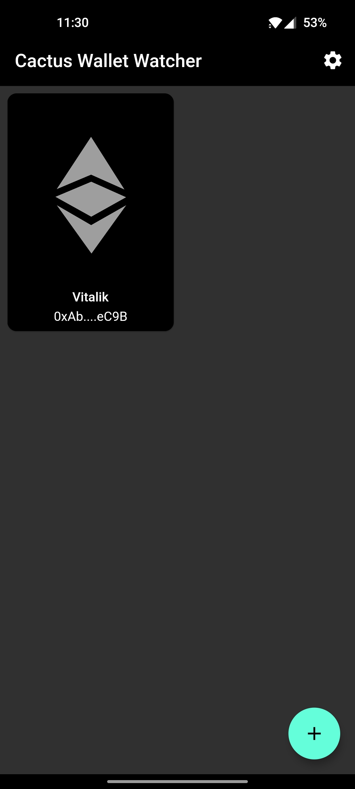
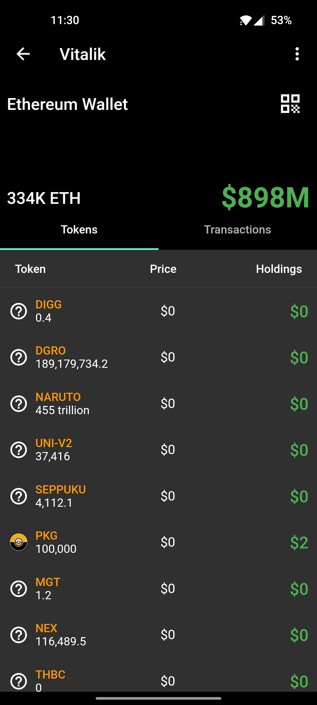
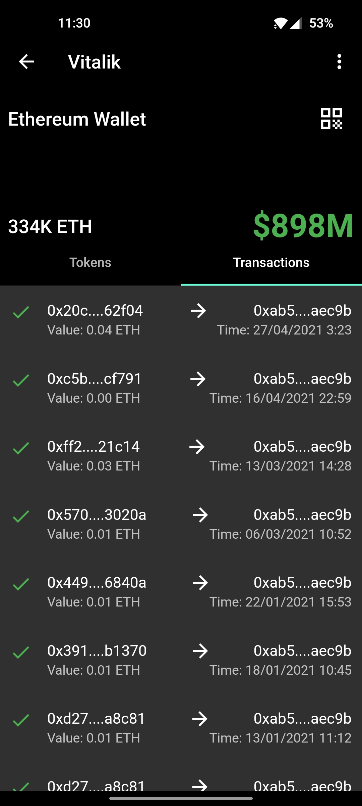
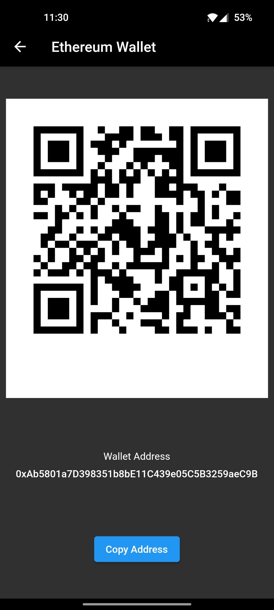
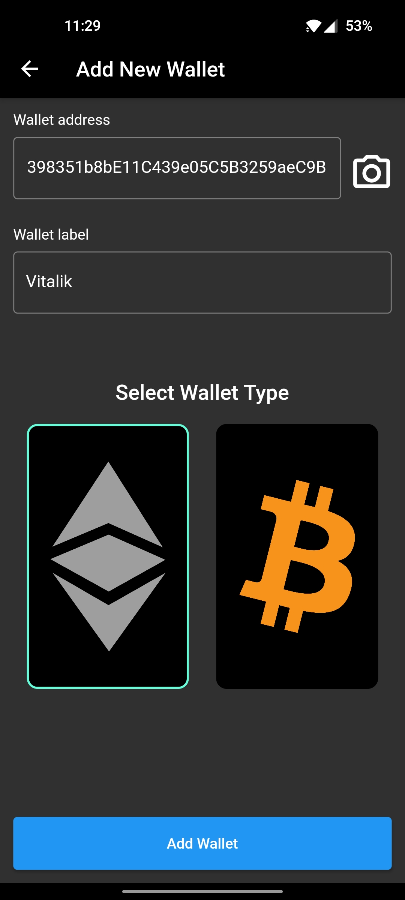

# Cactus Wallet Watcher
Keep an eye on your wallet, or others'. This app is built using [Flutter](https://flutter.dev) framework.

## Screenshots
     

## Features
- Simple and intuitive Ethereum wallet watcher
- Keep an eye on your wallet's tokens and transactions

### Upcoming Features
- Bitcoin wallet watching
- Wallet renaming
- ... and many more

## Packages used
- [Flutter Riverpod](https://pub.dev/packages/flutter_riverpod)
- [URL Launcher](https://pub.dev/packages/url_launcher)
- [Animations](https://pub.dev/packages/animations)
- [Hive](https://pub.dev/packages/hive)
- [Hive Flutter](https://pub.dev/packages/hive_flutter)
- [Hive Generator](https://pub.dev/packages/hive_generator)
- [Fluttertoast](https://pub.dev/packages/fluttertoast)
- [Intl](https://pub.dev/packages/intl)
- [QR Flutter](https://pub.dev/packages/qr_flutter)
- [Coingecko Dart](https://pub.dev/packages/coingecko_dart)

## Installation
Install by either sideloading attacked [APK file](https://github.com/KhalidWar/cactus_wallet_watcher/releases) on your android device or by building project from source following steps below.

### Getting Started
Check out [Flutter's official guide](https://flutter.dev/docs/get-started/install) to installing and running flutter.

### Prerequisites
- Download an IDE either [Android Studio](https://developer.android.com/studio) or [VSC](https://code.visualstudio.com/)
- Install Flutter SDK and Dart plugin
- Emulator or physical device

### Steps
- Clone this repo to your machine: `https://github.com/KhalidWar/cactus_wallet_watcher.git`
- Run on Emulator or physical device
- All set!

## License
This project is licensed under [MIT License](https://github.com/KhalidWar/cactus_wallet_watcher/blob/master/LICENSE).
